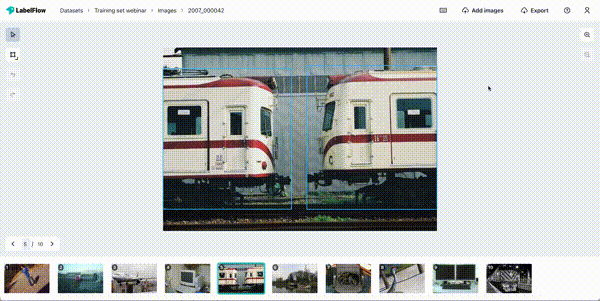
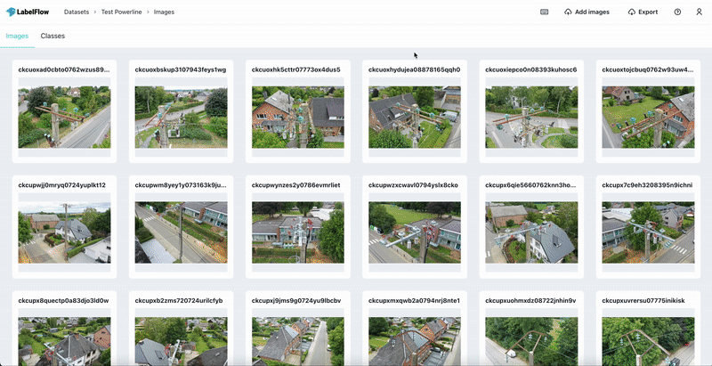

# Simple object detection

This work illustrates how to build an object detection algorithm prototype from image labelling to qualitative and quantitative evaluation of a model. All you need to get started is a set of raw images that are relevant to the task you want to address.

This workflow was presented and run during [LabelFlow's Webinar](https://www.youtube.com/watch?v=htNppk_80cA) on how to build and AI model in no time

The inspiration for this work comes from the torchvision object detection [tutorial](https://pytorch.org/tutorials/intermediate/torchvision_tutorial.html) with the minimum requirements to actually use the trained model added on top. The framework is based on PyTorch and most of the utils are just copied from torchvision [references](https://github.com/pytorch/vision/tree/main/references/detection). The framework's inputs and outputs are all datasets in [COCO](https://cocodataset.org/#format-data) format, which is one of the reference formats for manipulating annotated images.

Data labellisation and visualization are done on [LabelFlow](https://labelflow.ai/) an open-source annotation platform that doesn't need any sign-up and that doesn't store your images.
## 0 - Install the requirements

- Make sure that you have python 3.x installed. This was tested with python 3.8.0.

- It is recommended to create a new virtual environment to avoid interferences with your global libraries, you can follow [this tutorial](https://packaging.python.org/guides/installing-using-pip-and-virtual-environments/#creating-a-virtual-environment) to create one. Additionaly, run `pip install Cython` on your blank virtual environment before installing the requirements.

- If you wish to make use of a GPU, you should make sure that the version of `torch` you use is compatible with your environment. Just follow the instructions on [PyTorch](https://pytorch.org/get-started/locally/).

```
pip install -r requirements.txt
```

You should then be able to run the following line without encountering any issue.

```
python train.py --dataset-path data/sample-coco-dataset
```

The device that is used for training is logged at the beginning of the training script, e.g. "`Running training on device cpu`" or "`Running training on device cuda`". This can help you make sure that your GPU is actually being used if you wish to use it.

## 1 - Label your images and train a model

<p align="center">
  
</p>

A viable dataset should have the following properties:

- Big enough: there's between 100 and 1000 labels per class. Keep in mind that the higher this number is, the better the model will get.

- Balanced: there's approximately the same amount of labels per class

- Consistent: the images' distribution reflects the reality of the task you're trying to address

Connect on [LabelFlow](https://labelflow.ai/), upload and label your raw images. Export them to COCO format, making sure that you toggle the options to include the images.

<p align="center">
  
</p>

The following script will train a new model for you on the coco dataset that you just exported - or any coco format dataset respecting the structure of `data/sample-coco-dataset`. 

```
python train.py --dataset-path <coco-dataset-directory-path>
```

After each epoch, the script will print evaluation metrics on a validation dataset that is split from the original one. The model's snapshot weights will be stored after each training epoch in `outputs/models/<dataset name>/epoch_<snapshot index>.pth`.

## 2 - Make inferences and visualize them

<p align="center">
  
</p>

The following script runs your model on a coco dataset and generates a coco annotation file containing the inferences in `outputs/inferences/<dataset name>_annotations.json`. Typically, you can create a raw dataset on LabelFlow and export it as shown above to generate the correct input for the model.

```
python detect.py --dataset-path <coco-dataset-directory-path> --model-path <model-snapshot-path>
```

You can then qualitatively evaluate your prototype by importing the output annotation file to the corresponding raw dataset on [LabelFlow](https://labelflow.ai/) as shown in the above schema.

<p align="center">
  
</p>

## 3 - Next steps

You can tune the parameters in `train.py` and in `detect.py` to optimize the performance of your prototype. If the results are satisfying, you can add more training data and switch to a more scalable and configurable framework like [Detectron2](https://github.com/facebookresearch/detectron2). 
